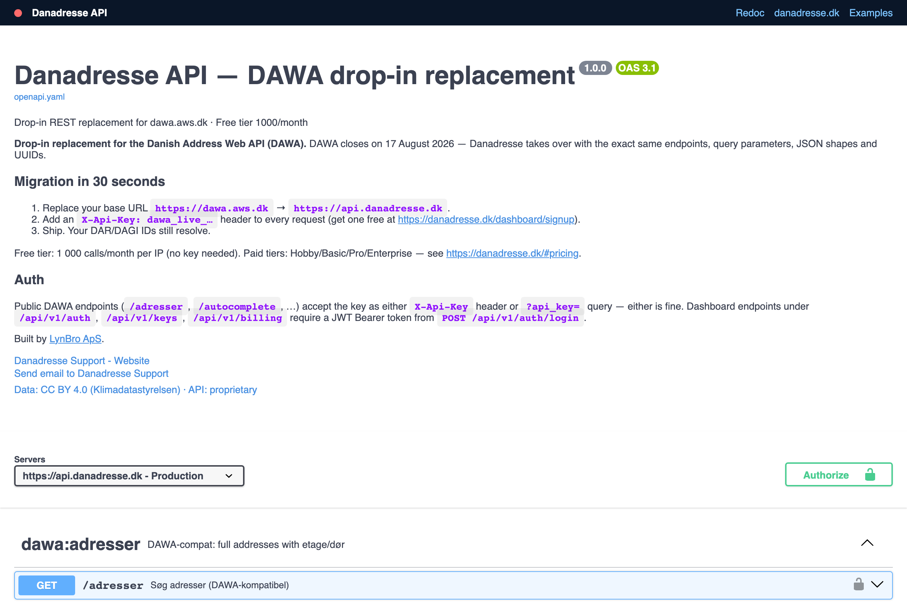

<!-- This file is the source for the PUBLIC danadresse-docs repo README.
     The public repo is GENERATED by scripts/sync_public_docs.sh — do not edit
     the public repo directly; edit here in the private repo and re-sync. -->
# Danadresse — public API docs, examples & MCP server

[](https://api.danadresse.dk/api/v1/healthz)
[](openapi.yaml)
[](https://andrey-tut.github.io/danadresse-docs/)
[](https://www.npmjs.com/package/@danadresse/client)
[](https://www.npmjs.com/package/@danadresse/mcp-server)
[](LICENSE)

**Danadresse** is a drop-in replacement for [DAWA](https://dawa.aws.dk) (Danmarks
Adressers Web API), which **closes 1 October 2026**. Same endpoints, same query
parameters, same JSON shapes — migration is a base-URL change plus an
`X-Api-Key` header. Backed by its own data from Datafordeleren (DAR, BBR,
Matriklen, DAGI), so it keeps working after DAWA shuts down.

> This is the **public** repo: API reference, client examples and the MCP server.
> The backend is private. Product site: <https://danadresse.dk>.

## 📖 Interactive API reference

[](https://andrey-tut.github.io/danadresse-docs/swagger.html)

- **Swagger UI (try it live):** <https://andrey-tut.github.io/danadresse-docs/swagger.html> — pick the `api.danadresse.dk` server, hit **Authorize** with your API key (free key: 2 000 calls/month) and **Try it out** on any endpoint
- **Redoc:** <https://andrey-tut.github.io/danadresse-docs/>
- **OpenAPI spec:** [`openapi.yaml`](openapi.yaml) · [`openapi.json`](openapi.json) — 130+ endpoints

## 🚀 Quick start

```bash
# A key is required on every call — get a free one (2 000 calls/month) at https://danadresse.dk:
curl -H "X-Api-Key: dawa_live_…" \
  "https://api.danadresse.dk/autocomplete?q=rådhuspladsen+1+københavn"

curl -H "X-Api-Key: dawa_live_…" \
  "https://api.danadresse.dk/datavask/adresser?betegnelse=rådhuspladsen+1+1550+københavn"
```

Migrating from DAWA? Change `api.dataforsyningen.dk` → `api.danadresse.dk`, add
the `X-Api-Key` header, done. See [`clients/migrate-cli`](clients/migrate-cli).

## 🤖 MCP server — Danish addresses for AI agents

[`@danadresse/mcp-server`](https://www.npmjs.com/package/@danadresse/mcp-server)
gives Claude Desktop / Claude Code / Cursor / Continue / Zed direct access to
2.4M Danish addresses (autocomplete, validation, reverse geocoding, DAGI, BBR,
quality scoring). No install — `npx` fetches it:

```json
{
  "mcpServers": {
    "danadresse": {
      "command": "npx",
      "args": ["-y", "@danadresse/mcp-server"],
      "env": { "DANADRESSE_API_KEY": "dawa_live_…" }
    }
  }
}
```

Full guide: [`examples/mcp`](examples/mcp) · source: [`mcp-server`](mcp-server).

## 🔁 DAWA's autocomplete widget (dawa-autocomplete2)

Loaded `dawa-autocomplete2.min.js` from dawa.aws.dk? We host the same library (v1.1.0, MIT)
on the same path, pointed at our API. Swap only the host and add your key — your
`dawaAutocomplete.dawaAutocomplete(…)` code and every option stay unchanged:

```html
<!-- before -->
<script src="https://dawa.aws.dk/js/autocomplete/dawa-autocomplete2.min.js"></script>
<!-- after -->
<script src="https://api.danadresse.dk/js/autocomplete/dawa-autocomplete2.min.js?key=YOUR_KEY"></script>
<link rel="stylesheet" href="https://api.danadresse.dk/css/dawa-autocomplete2.css">
```

The key can also be passed as `{ apiKey: '…' }` or `params: { api_key: '…' }`.
Guide: [danadresse.dk/migration#autocomplete-widget](https://danadresse.dk/en/migration#autocomplete-widget)

## 📦 Examples & clients

| | |
|---|---|
| [`examples/`](examples) | curl · Python · JavaScript · PHP · MCP |
| [`clients/python`](clients/python) | `pip install danadresse` |
| [`@danadresse/client`](https://www.npmjs.com/package/@danadresse/client) | `npm i @danadresse/client` (JS/TS) |
| [`clients/wordpress-plugin`](clients/wordpress-plugin) | WordPress / WooCommerce |
| [`clients/migrate-cli`](clients/migrate-cli) | DAWA → Danadresse migration CLI |

## License

Examples, clients and the MCP server in this repo are **MIT** licensed. The API
data follows the Datafordeleren licence (CC BY 4.0). The backend is proprietary.

---

🇩🇰 Built by [LynBro ApS](https://lynbro.dk). Issues & questions:
[open an issue](https://github.com/andrey-tut/danadresse-docs/issues) or
<hello@lynbro.dk>.
